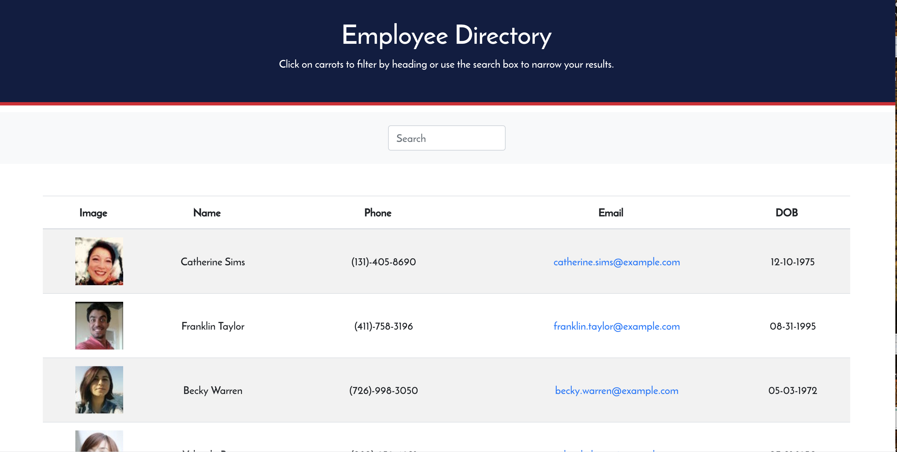

[](https://www.contributor-covenant.org/version/2/0/code_of_conduct/)

# **Employee Directory**

# Table of Contents

- [Project Description](#project-description)
- [Installation](#installation)
- [Usage](#usage)
- [Tests](#tests)
- [License](#license)
- [Contributions](#contributions)
- [Questions](#questions)

# Project Description

When the page loads, a table renders containing a list of employees. Clicking on the "Employees" button (located in the header of the table) will filter the employees by their gender and clicking on the "Name" button (also located in the header of the table) will sort the employees alphabetically by their first name.

# Installation

This application was made using React and requires no installation.

# Usage

The application is located here: [Employee Directory](https://infinite-thicket-84161.herokuapp.com/). Loading the webpage renders a table with randomly generated users obtained using the [Random User Generator API](https://randomuser.me/). Clicking the "Employee" button will filter the employees by gender, and clicking on the "Name" button will sort the employees by their first name.

# Tests

Tests can be conducted locally. First a user can run the following command in the same directory as the 'package.json' file in order to install the necessary packages:

```sh
npm i
```

The application can then be started by running the following command:

```sh
npm start
```

# License

Licensed under the [MIT License](https://spdx.org/licenses/MIT.html).

# Contributions

This project is currently not accepting any contributions.

# Questions

If you have any questions, please contact the project owner by clicking on the email listed below.

#### gscalica@gmail.com

# Screenshot


